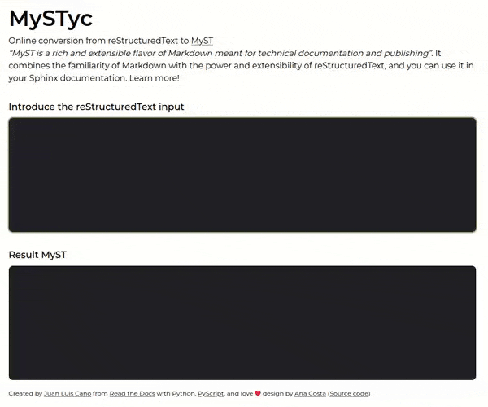

# MySTyc

[](https://pyscript.net/)

Online conversor of reStructuredText to MyST. Try it live here:

https://astrojuanlu.github.io/mystyc/



## Usage

To run the service locally, serve the HTML through any HTTP server:

```bash
(.venv) $ python -m http.server
```

and that's it!
